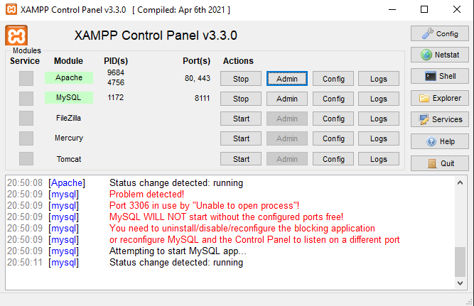
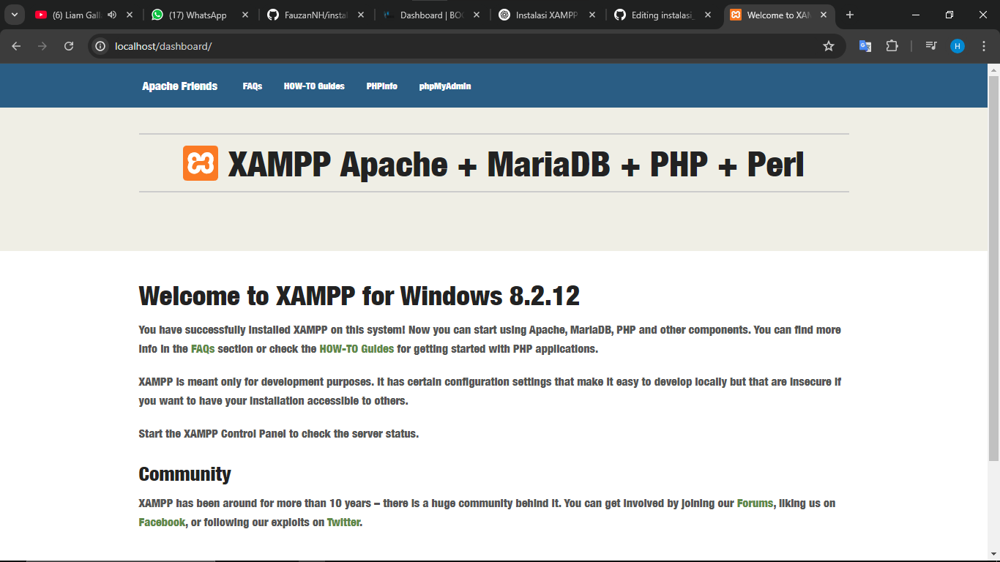
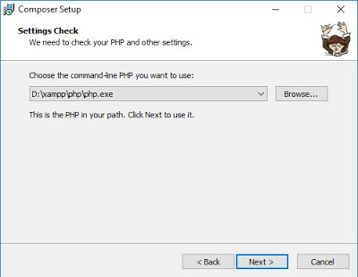
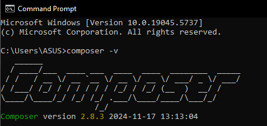
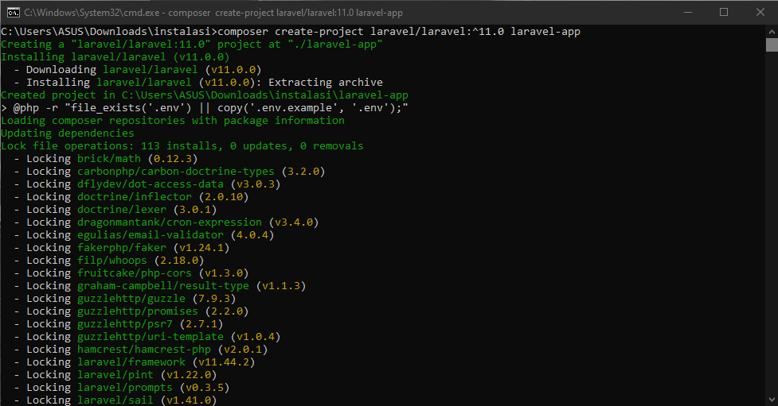
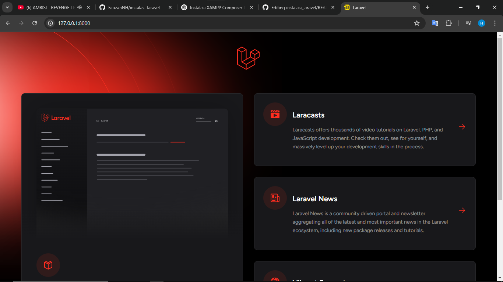
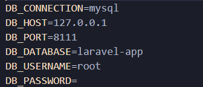

# 🚀 Panduan Instalasi XAMPP, Composer, dan Laravel 11 (Windows)

Dokumen ini menjelaskan langkah-langkah untuk menginstal XAMPP, Composer, dan Laravel 11 pada sistem operasi **Windows**, lengkap dengan gambar pendukung. Seluruh gambar disimpan di dalam folder [`images/`](./images/) dalam struktur repository GitHub.

---

## 1. 🔧 Instalasi XAMPP

### Langkah-langkah:

1. Unduh XAMPP dari situs resmi:  
   ➡️ https://www.apachefriends.org/download.html

2. Jalankan installer dan ikuti proses instalasi hingga selesai.

3. Buka **XAMPP Control Panel** dan aktifkan:
   - **Apache**
   - **MySQL**

4. Tampilan XAMPP Control Panel:

   

5. Buka browser dan akses:

   ```
   http://localhost/dashboard/
   ```

   Jika muncul tampilan seperti gambar di bawah, berarti Apache berhasil dijalankan:

   

---

## 2. 💡 Instalasi Composer

### Langkah-langkah:

1. Unduh Composer dari:  
   ➡️ https://getcomposer.org/download/

2. Jalankan installer dan arahkan ke `php.exe` milik XAMPP (contoh: `C:\xampp\php\php.exe`).

   

3. Verifikasi instalasi melalui Command Prompt:

   ```bash
   composer -V
   ```

   

---

## 3. ⚙️ Instalasi Laravel 11

### Langkah-langkah:

1. Buka terminal (CMD, PowerShell, atau Git Bash).

2. Jalankan perintah untuk membuat proyek Laravel 11:

   ```bash
   composer create-project laravel/laravel:^11.0 nama-proyek
   ```

   Contoh:

   ```bash
   composer create-project laravel/laravel:^11.0 laravel-app
   ```

   

3. Masuk ke folder proyek:

   ```bash
   cd laravel-app
   ```

4. Jalankan server Laravel:

   ```bash
   php artisan serve
   ```

5. Akses Laravel di browser:

   ```
   http://127.0.0.1:8000
   ```

   

---

## 4. ⚠️ Konfigurasi Database

1. Buka `http://localhost/phpmyadmin` untuk membuat database baru.
2. Buka file `.env` di folder Laravel dan sesuaikan:

   ```dotenv
   DB_CONNECTION=mysql
   DB_HOST=127.0.0.1
   DB_PORT=8111
   DB_DATABASE=laravel-app
   DB_USERNAME=root
   DB_PASSWORD=
   ```

   

---

## 📚 Referensi

- Laravel 11 Docs: https://laravel.com/docs/11.x
- Composer: https://getcomposer.org
- XAMPP: https://www.apachefriends.org

---

📅 **Selesai!**

